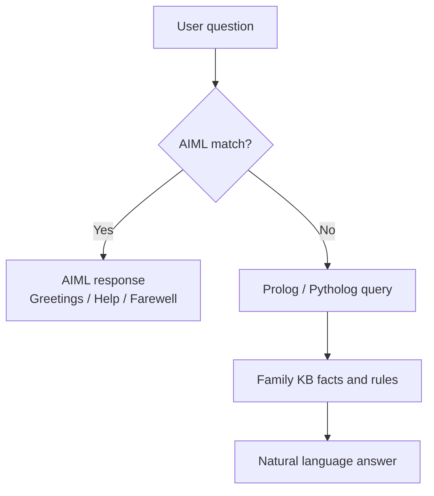

<<<<<<< HEAD
# Family Knowledge Base Chatbot

A family-reasoning chatbot with **two interfaces powered by the same brain**:

- **Console app** for terminal use
- **Streamlit web app** for a live, polished UI

It uses:

- **pytholog** – Prolog-in-Python for logic and inference
- **python-aiml** – AIML-based greetings, help, and simple routing
- **Streamlit** – for the web interface

---

## 1. Install dependencies

```bash
pip install -r requirements.txt
```

If you prefer installing manually:

```bash
pip install pytholog python-aiml streamlit
```

> Python 3.8 or newer is recommended.

---

## 2. Run locally

### Console version

```bash
python main.py
```

### Streamlit version

```bash
streamlit run streamlit_app.py
```

The Streamlit app uses the **same KB and same `handle_input()` logic** as the console version.

---

## 3. Add your profile image to the UI

To show your picture in the web app, place an image in:

```text
assets/profile.png
```

Supported fallback filenames:

- `assets/profile.jpg`
- `assets/profile.jpeg`
- `assets/profile.webp`

If the file exists, Streamlit uses it as the assistant avatar while replying.

---

## 4. Upload the project to GitHub

If you already created this repository on GitHub, push the local project with:

```bash
git add .
git commit -m "Add Streamlit chatbot UI"
git branch -M main
git push -u origin main
```

If the remote is not connected yet, add it once:

```bash
git remote add origin https://github.com/mudassar2224/Knowledge-representation-and-Reasoning--Assginment-01.git
```

Then push again:

```bash
git push -u origin main
```

Make sure these files are included in GitHub:

- `streamlit_app.py`
- `family_kb.pl`
- `family.aiml`
- `requirements.txt`
- `assets/profile.png` or your chosen avatar image

---

## 5. Deploy on Streamlit Cloud

After the repo is on GitHub:

1. Go to **https://share.streamlit.io/**
2. Sign in with GitHub
3. Choose this repository
4. Set the main file to `streamlit_app.py`
5. Click **Deploy**

Whenever you update the code:

```bash
git add .
git commit -m "Update Streamlit UI"
git push
```

Streamlit Cloud will redeploy after the push.

---

## 6. What the chatbot can answer

The bot is **knowledge-base driven**. It answers family questions such as:

| Input | Example output |
|---|---|
| `Who is Ali's father?` | `Ali's father is Shakeel.` |
| `What is Ali's dob?` | `Ali's date of birth is 2000-05-12.` |
| `Who lives in Lahore?` | `Family members in Lahore: ...` |
| `Tell me about Ali` | Full family profile for Ali |
| `Is Shakeel an ancestor of Zain?` | `Yes, Shakeel is Zain's ancestor.` |

> It does **not** use external internet AI. So it answers the family KB very well, but general open-domain questions still fall back to the help message.

---

## 7. How AIML and Prolog work together



**AIML** handles:

- Greetings and farewells
- Help text and simple routing

**Prolog / Pytholog** handles:

- Parent / child / sibling relations
- Extended family relations like `chacha`, `maamu`, `dada`, `nani`
- Transitive rules like `ancestor`, `descendant`, `blood_relative`
- Property facts like `dob`, `occupation`, `lives_in`, and `religion`

---

## 8. Project structure

```text
Family_Chatboat/
├── main.py
├── streamlit_app.py
├── chatbot.py
├── prolog_engine.py
├── aiml_bot.py
├── utils.py
├── family_kb.pl
├── family.aiml
├── assets/
│   └── profile.png   ← optional avatar image for Streamlit
├── requirements.txt
└── README.md
```

---

## 9. Known limitations

- `pytholog` does not support `\+`, `;`, or `!`, so the KB rules avoid those operators.
- Some symmetric relations can produce duplicates; the chatbot deduplicates results before display.
- `python-aiml` uses uppercase patterns, so inputs are normalized before AIML matching.
- The bot is stateless; it does not remember previous turns.

---

## 10. Notes

- The Streamlit UI now stays compact and KB-driven.
- You can keep improving the UI inside `streamlit_app.py` without changing the reasoning core.
=======
# Knowledge-representation-and-Reasoning--Assginment-02
>>>>>>> bc0f70ba0cf363b1b794ad771a1d41f81ee4f147
